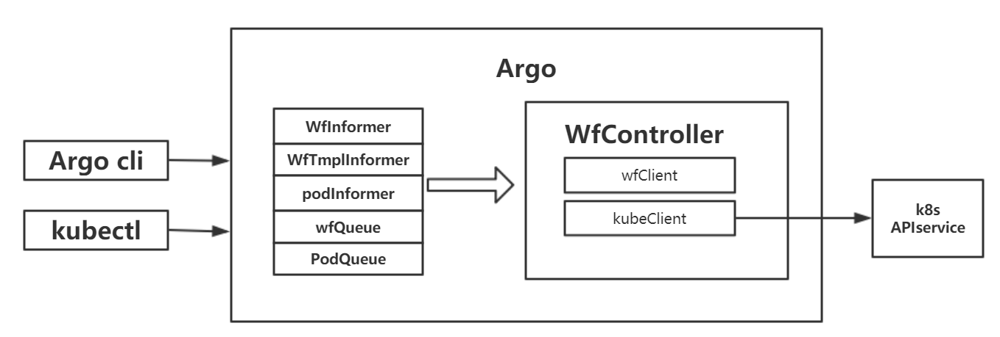

[toc]

### 调度引擎Workflow方案调研 [补充argo]

### 1.argo简介

 argo 是一个基于 kubernetes CRD 实现的一个 Workflow(工作流) 工具，基于 kubernetes 的调度能力实现了工作流的控制和任务的运行；

<br>

#### 1.1 template

 template 是argo中一个非常重要的概念，它是配置 Workflow 的支撑，在配置workflow的Yaml文件中必须制定Template； 

template 在 argo 中代表可运行的节点，一共有 `6` 种分类，分别是 `Container`, `Script`, `Resource`, `Suspend`, `Steps`, `DAG`; 

<br>

#### 1.2 DAG

 其他template类型的简介可以参考附录A。

该类型可以定义我们的 DAG 类型 workflow， 在其中我们根据 `依赖` 来进行 DAG 的定制，没有 `依赖` 的 `Task` 将会作为 DAG 的 root 首先运行; 目前 DAG 中 Task 还不支持相关条件判断表达式来进行条件判断； 

简单实例:

```rust
apiVersion: argoproj.io/v1alpha1
kind: Workflow
metadata:
  generateName: dag-diamond-
spec:
  entrypoint: diamond    //指定要执行的节点
  templates:
  - name: echo     
    inputs:
      parameters:
      - name: message
    container:                //container类型
      image: alpine:3.7
      command: [echo, "{{inputs.parameters.message}}"]
  - name: diamond
    dag:
      tasks:
      - name: A
        template: echo
        arguments:
          parameters: [{name: message, value: A}]
      - name: B
        dependencies: [A]
        template: echo
        arguments:
          parameters: [{name: message, value: B}]
      - name: C
        dependencies: [A]
        template: echo
        arguments:
          parameters: [{name: message, value: C}]
      - name: D
        dependencies: [B, C]
        template: echo
        arguments:
          parameters: [{name: message, value: D}]
```

<br>

#### 1.3 DAG的实现流程



（1）wfClient从wfQueue队列获取一个workflow作业

（2）执行executeTemplate函数，开始运行Template的节点

```go
	switch processedTmpl.GetType() {
	case wfv1.TemplateTypeContainer:
		node, err = woc.executeContainer(nodeName, templateScope, processedTmpl, orgTmpl, boundaryID)
	case wfv1.TemplateTypeSteps:
		node, err = woc.executeSteps(nodeName, newTmplCtx, templateScope, processedTmpl, orgTmpl, boundaryID)
	case wfv1.TemplateTypeScript:
		node, err = woc.executeScript(nodeName, templateScope, processedTmpl, orgTmpl, boundaryID)
	case wfv1.TemplateTypeResource:
		node, err = woc.executeResource(nodeName, templateScope, processedTmpl, orgTmpl, boundaryID)
	case wfv1.TemplateTypeDAG:
		node, err = woc.executeDAG(nodeName, newTmplCtx, templateScope, processedTmpl, orgTmpl, boundaryID)
	case wfv1.TemplateTypeSuspend:
		node, err = woc.executeSuspend(nodeName, templateScope, processedTmpl, orgTmpl, boundaryID)
	default:
		err = errors.Errorf(errors.CodeBadRequest, "Template '%s' missing specification", processedTmpl.Name)
		return woc.initializeNode(nodeName, wfv1.NodeTypeSkipped, orgTmpl, boundaryID, wfv1.NodeError, err.Error()), err
	}
```

(3) dag类型的workflow 由executeDAG进行处理。主要步骤

a.获取DAG的所有tasks，按照拓扑关系，依次运行task。

b.执行executeTemplate函数,由于这次的task是container类型，所以在executeTemplate中会执行executeContainer

c. executeContainer通过kubeclient创建对应的Pod。（k8s的客户端）

d.pod完成之后，回到步骤a，继续运行未完成的task


以上文的**简单实例**为例：

(1) argo获取到名为dag-diamond-的workflow

(2) executeTemplate函数中发现该workflow的template是DAG类型，调用executeDAGTask函数进行处理

(3) executeDAGTask函数对DAG的tasks进行拓扑关系分析，先执行A，然后是BC，最后D。

每次执行之前判断A/B/C/D是否能执行。（shouldEexcute）

(4) executeDAG执行A时，同样调用executeTemplate进行处理

(5) 由于A是Container类型，executeTemplate会调用executeContainer

(6) executeContainer会产生POD，运行A

(7) A完成之后，回到步骤（3）执行B，C，最后是D


TODO：

（1）验证上述逻辑

a. 修改executeContainer，调用kube-scheduler调度job

b. 修改shouldEexcute，监听job是否完成。

验证这种方式是否可行？


### 附录A：template的其他5种节点类型

#### 1.Container

 该类型定义了我们一个容器运行的基础，会对应于我们在 kubernetes 中产生一个实际的 pod，
该实体的类型对应于标准 kubernetes 的 Container resource，kubernetes Container 具有的参数我们都可以在其中使用； 

```rust
name: sleep-n-sec
container:
    image: alpine:latest
    command: [sh, -c]
    args: ["echo sleeping for {{inputs.parameters.seconds}} seconds; sleep {{inputs.parameters.seconds}}; echo done"]
```

<br>

#### 2.Script 

该类型支持我们直接在 template 中定义并允许一段脚本，该 template 类型也是基于 Container 的，
不过在 Container 的类型上面添加了一个 Source 字段来表示我们的脚本，我们在 Container 的运行配置中应该注释初始化我们脚本运行的环境；

简单实例:

```rust
name: gen-number-list
script:
    image: python:alpine3.6
    command: [python]
    source: |
        import json
        import sys
        json.dump([i for i in range(20, 31)], sys.stdout)
```

<br>

#### 3.Resource 

该类型支持我们在 tempalte 中对 kubernetes 中资源操作的能力，我们可以 `create`, `apply`, `delete`, `replace` 
(对应该模板的`action`字段) k8s 中的资源；并且支持设定相关的成功与失败条件用于判断该 tempalte 的成功与失败；

简单实例:

```rust
name: pi-tmpl
resource:                   #indicates that this is a resource template
    action: create            #can be any kubectl action (e.g. create, delete, apply, patch)
    # The successCondition and failureCondition are optional expressions.
    # If failureCondition is true, the step is considered failed.
    # If successCondition is true, the step is considered successful.
    # They use kubernetes label selection syntax and can be applied against any field
    # of the resource (not just labels). Multiple AND conditions can be represented by comma
    # delimited expressions.
    # For more details: https://kubernetes.io/docs/concepts/overview/working-with-objects/labels/
    successCondition: status.succeeded > 0
    failureCondition: status.failed > 3
    manifest: |               #put your kubernetes spec here
        apiVersion: batch/v1
        kind: Job
        metadata:
            generateName: pi-job-
        spec:
            template:
            metadata:
                name: pi
            spec:
                containers:
                - name: pi
                image: perl
                command: ["perl",  "-Mbignum=bpi", "-wle", "print bpi(2000)"]
                restartPolicy: Never
            backoffLimit: 4
```

<br>

#### 4.Suspend

该类型可以对我们的 Workflow 进行挂起操作，当我们运行到该类型的 template 时，我们的 Workflow 将会挂起，等待我们运行 `argo resume {name}` Workflow 才会继续运行下去；同时对于挂起操作，我们也可以直接运行 `argo suspend {name}` 来挂起某个 Workflow；

简单实例:

```rust
name: suspend-test
suspend: {}
```

<br>

#### 5.Steps 

该类型可以让我们把 template 组合成一条 pipeline 来进行运行，并且在流程中还支持 tempalte 间参数的传递，条件的判断，递归调用...; 它使用一个二维数组来进行定义，在第一级数组串行运行，在第二级数组并行运行；

简单实例:

```rust
name: coinflip
steps:
# flip a coin
- - name: flip-coin
    template: flip-coin
# evaluate the result in parallel
- - name: heads
    template: heads                 # 条件判断， 目前只支持 `==` 与 `!=`
    when: "{{steps.flip-coin.outputs.result}} == heads"
  - name: tails                   
    template: coinflip              # 递归调用
    when: "{{steps.flip-coin.outputs.result}} == tails"  # 条件判断
  - name: heads1
    template: heads
```